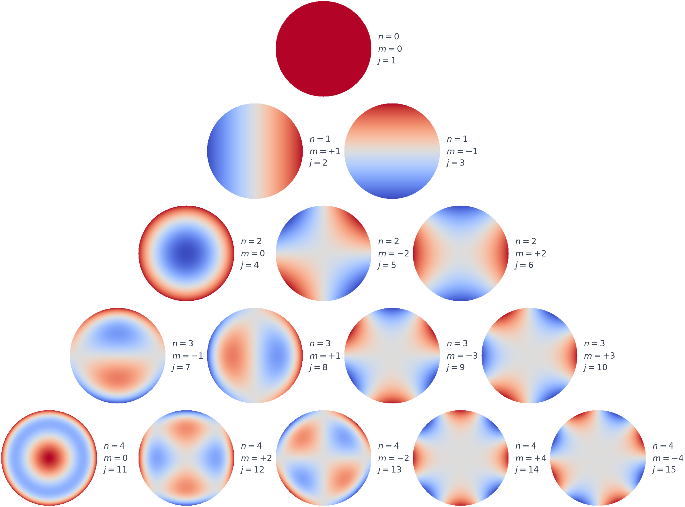

# Zernike 拟合与分解

本项目使用的是 **Noll Zernike**多项式，Zemax中表述为 Zernike Standard Polynomials 。径向多项式由阶乘系数的有限求和式直接计算，然后在有效圆孔径内用最小二乘拟合系数。详情参见光学车间检测 383 页，公式 (13.47)，英文第三版第 13 章 *Zernike Polynomial and Wavefront Fitting*，498–546 页。

## Zernike多项式

#### 概述

Zernike 多项式是定义在单位圆孔径上的一组完备正交函数。1934 年，F. Zernike 在研究相衬显微与衍射问题时系统提出了这组多项式[1]。由于大多数光学系统的有效孔径近似为圆形，Zernike 多项式能够以较少的系数描述离焦、像散、彗差和球差等典型波前形状，因此被广泛用于干涉检测、波前传感、光学设计和自适应光学。

#### 基础定义

Zernike 多项式定义在单位圆内。采用极坐标表示孔径内的位置
$$
0\leq\rho\leq1,\qquad 0\leq\theta<2\pi,
$$
其中，\(\rho\) 表示某一点到孔径中心的归一化距离，孔径中心为 \(\rho=0\)，孔径边缘为 \(\rho=1\)；\(\theta\) 表示该点相对于 \(x\) 轴的方向角。每一个 Zernike 多项式都可以看成径向部分和角向部分的乘积：
$$
Z_n^m(\rho,\theta)
=
\underbrace{R_n^{|m|}(\rho)}_{\text{径向部分}}
\underbrace{\Theta_m(\theta)}_{\text{角向部分}}.
$$
径向阶数 \(n\) 决定多项式中最高的径向幂次，方位频率 \(|m|\) 决定波前沿圆周方向重复变化的次数。可以把圆形孔径想象成一个靶子，径向部分决定沿着靶心向外走时，数值如何变化；角向部分决定绕着靶心转动时，数值如何变化。

#### 径向部分

Zernike 多项式的径向部分记为\(R_n^m(\rho)\)，采用直接有限和来定义
$$
R_n^m(\rho)=
\sum_{s=0}^{(n-m)/2}
(-1)^s
\frac{(n-s)!}
{s!\left(\frac{n+m}{2}-s\right)!
\left(\frac{n-m}{2}-s\right)!}
\rho^{n-2s},
$$

其中 $m\leq n$，且 $n-m$ 必须为偶数。径向阶数 \(n\) 决定多项式中最高的径向幂次，\(m\) 则同时参与确定允许出现的径向形式。

举例：$R_2^0(\rho)=2\rho^2-1$表示波前从圆心到边缘由负值逐渐变为正值。因为这一项不包含方向角，所以在所有方向上的变化完全相同。

#### 角向部分

Zernike 多项式的角向部分记为\(\Theta_m(\theta)\)，由正弦函数或余弦函数表示。
当 \(m=0\) 时，Zernike 多项式不随方向角变化，是一个纯径向模式：
$$
\widetilde Z_{n,0}(\rho)=R_n^0(\rho).
$$
当 \(m>0\)​ 时，存在两个相互正交的角向基函数：
$$
\Theta_m^{\mathrm c}(\theta)=\cos(m\theta), \qquad \Theta_m^{\mathrm s}(\theta)=\sin(m\theta).
$$
将径向部分与角向部分相乘，可以得到尚未归一化的实值 Zernike 模式：
$$
\begin{aligned}
    \widetilde Z_{n,m}^{\mathrm c}(\rho,\theta) = R_n^m(\rho)\cos(m\theta), \\
    \widetilde Z_{n,m}^{\mathrm s}(\rho,\theta) = R_n^m(\rho)\sin(m\theta).
\end{aligned}
$$
其中，\(\cos(m\theta)\) 和 \(\sin(m\theta)\) 决定模式的方向，\(m\) 决定波前绕圆周变化的次数。

举例：当 \(n=2,m=2\) 时，$R_2^2(\rho)=\rho^2$，与余弦和正弦角向函数组合后得到
$$
\widetilde  Z_{2,2}^{\mathrm c}
\propto
\rho^2\cos(2\theta), \qquad \widetilde  Z_{2,2}^{\mathrm s}
\propto
\rho^2\sin(2\theta).
$$
这两个模式具有相同的径向变化，但方向不同，对应两个方向的像散。

#### Noll Zernike与归一化

由上述定义可以看出，一个实值 Zernike 模式需要由径向阶数 \(n\)、方位频率 \(m\) 以及正弦或余弦分支共同确定。为了用一个序号表示每个模式，Noll 引入了单序号$j$对所有实值 Zernike 模式进行排列。

在径向阶数$n$之前一共有$J_n=n(n+1)/2$个模式，因此第$n$阶从$n(n+1)/2+1$开始编号。当$m=0$时，仅有一个纯径向模式。当时，同一个$(n,m)$会对应正弦和余弦两种模式
$$
j_1=\frac{n(n+1)}2+m,\qquad
j_2=\frac{n(n+1)}2+m+1.
$$
为了区分，Noll进一步规定
$$
\begin{cases}
j\text{ 为偶数}, & \text{采用 }\cos(m\theta),\\
j\text{ 为奇数}, & \text{采用 }\sin(m\theta).
\end{cases}
$$
因此，可以通过$n$、$m$正弦或余弦分支共同确定模式编号$j$。

采用 Noll 归一化构造
$$
Z_j(\rho,\theta)=
\begin{cases}
\sqrt{n+1}\,R_n^0(\rho), & m=0,\\[4pt]
\sqrt{2(n+1)}\,R_n^m(\rho)\cos(m\theta), & m\ne0,\ j\text{ 为偶数},\\[4pt]
\sqrt{2(n+1)}\,R_n^m(\rho)\sin(m\theta), & m\ne0,\ j\text{ 为奇数}.
\end{cases}
$$

该归一化满足单位圆上的正交关系

$$
\int_0^{2\pi}\int_0^1 Z_jZ_k\,\rho\,d\rho\,d\theta
=\pi\,\delta_{jk}.
$$

其中 \(\delta_{jk}\) 为 Kronecker delta：
$$
\delta_{jk}= \begin{cases} 1, & j=k,\\ 0, & j\neq k. \end{cases}
$$
当 \(j\neq k\) 时，积分结果为零，表示两个不同的 Zernike 模式在完整单位圆上相互正交；当 \(j=k\) 时，有
$$
\frac{1}{\pi}
\int_0^{2\pi}\int_0^1
Z_j^2(\rho,\theta)
\,\rho\,d\rho\,d\theta
=1.
$$
因此，每个经过 Noll 归一化的 Zernike 模式在单位圆上的均方根值均为 1。进行波前分解时，拟合系数便可以直接反映相应模式对波前均方根值的贡献。

## 多项式与系数对应关系

Noll 的表1使用单一序号 $j=1,2,\ldots$ 排列二维指标 $(n,m)$：

- 先按径向阶数 $n$ 从低到高排列；
- 同一 $n$ 内，较小的方位频率 $m$ 先出现；
- $m\ne0$ 时，偶数 $j$ 使用 $\cos(m\theta)$，奇数 $j$ 使用 $\sin(m\theta)$；
- $m=0$ 时只有一个纯径向项。

前 15 项 Noll Zernike 多项式为：

| \(j\) | \(n\) | $\lvert m \rvert$ | Zernike 多项式 | 常用名称 |
|---:|---:|---:|---|---|
| 1 | 0 | 0 | \(1\) | Piston，活塞或常数项 |
| 2 | 1 | 1 | \(2\rho\cos\theta\) | X 倾斜 |
| 3 | 1 | 1 | \(2\rho\sin\theta\) | Y 倾斜 |
| 4 | 2 | 0 | \(\sqrt3(2\rho^2-1)\) | 离焦 |
| 5 | 2 | 2 | \(\sqrt6\rho^2\sin2\theta\) | 45°像散 |
| 6 | 2 | 2 | \(\sqrt6\rho^2\cos2\theta\) | 0°像散 |
| 7 | 3 | 1 | \(\sqrt8(3\rho^3-2\rho)\sin\theta\) | Y 彗差 |
| 8 | 3 | 1 | \(\sqrt8(3\rho^3-2\rho)\cos\theta\) | X 彗差 |
| 9 | 3 | 3 | \(\sqrt8\rho^3\sin3\theta\) | 三叶像差 |
| 10 | 3 | 3 | \(\sqrt8\rho^3\cos3\theta\) | 三叶像差 |
| 11 | 4 | 0 | \(\sqrt5(6\rho^4-6\rho^2+1)\) | 初级球差 |
| 12 | 4 | 2 | \(\sqrt{10}(4\rho^4-3\rho^2)\cos2\theta\) | 二级像散 |
| 13 | 4 | 2 | \(\sqrt{10}(4\rho^4-3\rho^2)\sin2\theta\) | 二级像散 |
| 14 | 4 | 4 | \(\sqrt{10}\rho^4\cos4\theta\) | 四叶像差 |
| 15 | 4 | 4 | \(\sqrt{10}\rho^4\sin4\theta\) | 四叶像差 |

## 波前拟合与面形求解

实际干涉仪得到的是离散采样的相位矩阵。设有效掩膜内共有 \(N\) 个像素，需要拟合前 \(J\) 项 Zernike 多项式。在第 \(p\) 个有效像素上计算第 \(j\) 个 Zernike 模式，组成矩阵
$$
A_{pj}=Z_j(\rho_p,\theta_p), \qquad \mathbf A\in\mathbb R^{N\times J}.
$$
将有效像素上的波前写成向量 \(\mathbf w\)，则 Zernike 系数通过最小二乘求解：
$$
\hat{\mathbf c} = \arg\min_{\mathbf c} \left\| \mathbf A\mathbf c-\mathbf w \right\|_2^2.
$$
若干涉仪输出的相位为 \(\phi\)，单位为弧度，则相位与光程差 OPD 的关系为
$$
\phi
=
\frac{2\pi}{\lambda}\mathrm{OPD}.
$$
对于反射式菲索干涉仪，光线经过被测面反射后形成双程光程差，有$\mathrm{OPD}=2h$，因此面形高度$h$为
$$
h=\frac{\lambda}{4\pi}\phi.
$$
相应的相位形式的Zernike系数$c_j^{(\phi)}$可以转化为面形高度系数
$$
c_j^{(h)}
=
\frac{\lambda}{2D\pi}
c_j^{(\phi)}.
$$

其中 $D$ 是软件中的双程因子；反射式菲索双程测量取 $D=2$，比例为 $\lambda/(4\pi)$。

而在分析时“去前 $K$ 项”表示计算

$$
W_K=\phi-\sum_{j=1}^{K}\hat c_j Z_j.
$$

在Noll编号下，去前 1 项只是去掉Piston常数，去前 3 项去掉Piston和两个倾斜，去前 4 项再去掉离焦。

## 参考文献

1. F. Zernike, “Beugungstheorie des Schneidenverfahrens und seiner verbesserten Form, der Phasenkontrastmethode,” *Physica* **1**, 689–704 (1934). [DOI: 10.1016/S0031-8914(34)80259-5](https://doi.org/10.1016/S0031-8914(34)80259-5)  

2. R. J. Noll, “Zernike polynomials and atmospheric turbulence,” *Journal of the Optical Society of America* **66**(3), 207–211 (1976). [DOI: 10.1364/JOSA.66.000207](https://doi.org/10.1364/JOSA.66.000207)  

3. V. N. Mahajan, “Zernike Polynomial and Wavefront Fitting,” in D. Malacara (ed.), *Optical Shop Testing*, 3rd ed., pp. 498–546, Wiley (2007). [DOI: 10.1002/9780470135976.ch13](https://doi.org/10.1002/9780470135976.ch13)  
   系统讲述 Zernike 多项式、像差和波前拟合。Wiley 的第三版目录确认该章页码为 498–546。

4. D. Malacara (ed.), *Optical Shop Testing*, 3rd ed., Wiley (2007). [DOI: 10.1002/9780470135976](https://doi.org/10.1002/9780470135976)  
