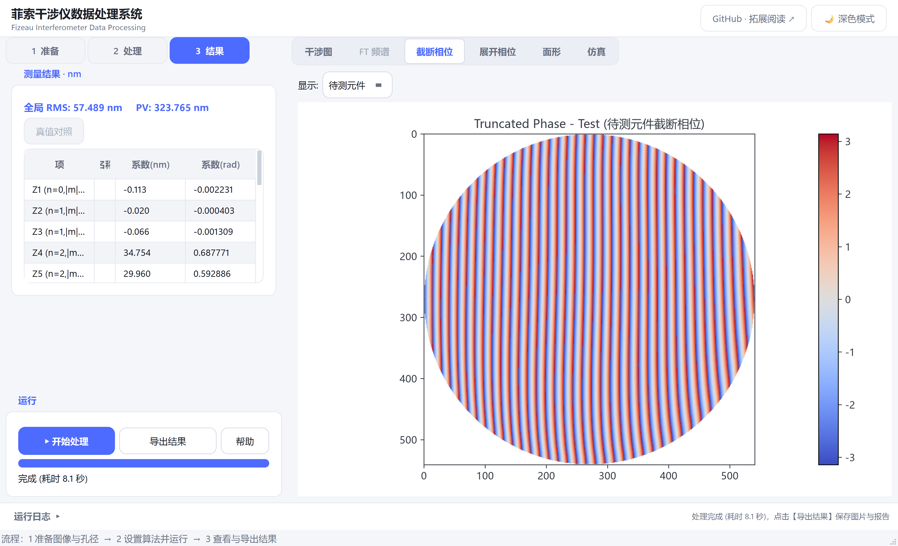
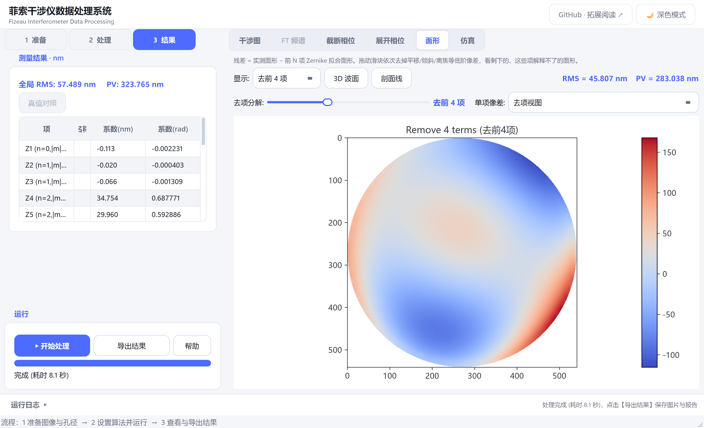
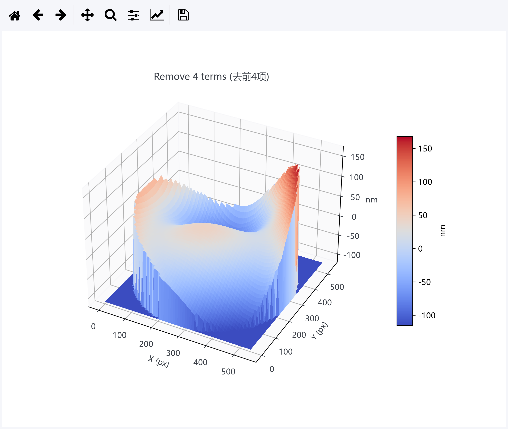
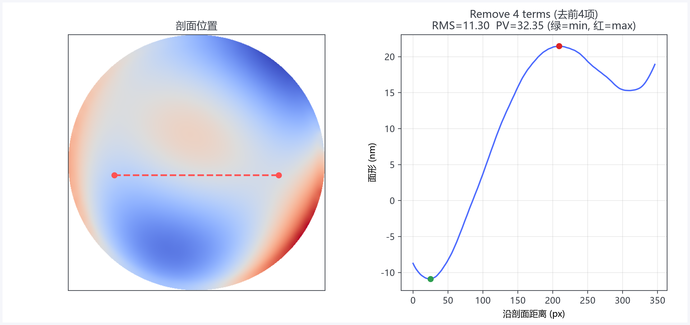

# 菲索干涉仪数据处理系统 — 使用说明

## 一、这是什么

本软件处理菲索干涉仪拍到的两张干涉条纹图（参考元件 + 待测元件），处理步骤为：

**圆形孔径掩膜 → 单帧相位提取→ 相位展开 → 相位差 → Zernike 多项式拟合→ RMS/PV 面形分析**

软件提供四种相位提取算法：**傅里叶变换FT**、**空间载波相移SCPS**、**最小二乘空间载波相移LS-SCPS**和**加窗傅里叶变换WFT**，默认使用傅里叶变换FT。使用该模式时，先观察二维频谱并手动选择一级边带，再依次进行去均值、二维 Hann 窗、Gaussian 滤波、移频、IFFT 和取复场相角；自动选峰可用于与手动结果对照。SCPS 使用已知条纹周期进行线性 $N$ 点正交解调，并在圆形有效孔径边缘约束采样窗口。WFT 会在有效孔径内去除缓变背景、自动识别二维载频方向，并按复场幅值置信度辅助相位展开。相位展开采用**质量图引导算法**（相位导数方差 PDV 质量图 + 最佳优先增长）；两幅图共用质量图与种子点，减少相位差中的支路不一致。

## 二、快速开始（3 分钟）

1. 双击打开软件；
2. 左侧进入【1 准备】，点击【浏览…】分别载入**参考元件干涉图**和**待测元件干涉图**（也支持把图片直接拖进窗口）；
3. 软件自动检测圆形孔径，图上出现绿色圆圈；
   - 拖动圆**内部** → 移动圆心；
   - 拖动圆**边缘**或滚动鼠标滚轮 → 调整半径；
   - 也可在左侧「有效孔径」里直接输入数值后点【应用掩膜】；
4. 切换到【2 处理】核对参数；若选择 FT，点击【查看频谱并手动点选一级边带】，先辨认中心 DC 和成对一级谱峰，再点击其中一个谱峰并调整 Gaussian σ；
5. 点击左栏底部固定的【▶ 开始处理】，等待进度条走完；未手动选择边带且未启用自动检测时，软件不会开始 FT 处理；
6. 完成后左栏自动切换到【3 结果】；FT 模式在右侧「FT 频谱」中核对所选边带和滤波结果，再查看截断相位 / 展开相位 / 面形；
7. 点击【导出结果】保存**全部图片 + 数据处理报告**。底部【运行日志】默认折叠，需要排查参数或错误时再展开。

## 三、参数说明

| 参数 | 默认 | 说明 |
|------|------|------|
| 条纹周期 | 15 像素 | 干涉图中**相邻两条亮条纹（或暗条纹）之间间隔的像素数**。数错会导致相位提取失败，可在图中放大量取 |
| 光源波长 | 635 nm | 实验所用激光波长（He-Ne 激光为 632.8） |
| 双程因子 | 2 | 双程反射测量（光线往返经过元件两次）取 2；单程透射测量取 1 |
| 相位算法 | 傅里叶变换FT | 可选傅里叶变换FT、[空间载波相移SCPS](algorithms/空间载波相移方法.md)、最小二乘空间载波相移LS-SCPS和加窗傅里叶变换WFT。SCPS 要求输入已知且近似恒定的条纹周期；LS-SCPS 参考 [Optical Engineering 59(2), 024103 (2020)](https://doi.org/10.1117/1.OE.59.2.024103)；WFT 参考 [Applied Optics 43, 2695–2702 (2004)](https://doi.org/10.1364/AO.43.002695) |
| 拟合项数 | 80 | Noll 顺序 Zernike 拟合项数，默认 80，越大越慢；编号、归一化和书籍页码见 [Zernike 说明](algorithms/Zernike拟合与Noll编号.md) |
| 分解项数 | 11 | 拟合完成后依次生成“去前 1 项”到“去前 N 项”的分解残差，不能超过拟合项数 |

选择“傅里叶变换FT”后会展开专用参数：

| FT 参数 | 默认 | 说明 |
|---|---|---|
| 手动选择一级边带 | 必做 | 点击按钮查看 ROI 的二维对数频谱；先找中心 DC，再点击与其分离的一个一级谱峰 |
| 手动 fx/fy | `0/0`（未选择） | 点击谱峰后自动记录其相对 DC 的坐标，单位为裁剪后图像的 cycles/image；也可直接输入 |
| Gaussian σ | `8 px` | 在手动选边带窗口中调整；小则更平滑但损失细节，大则保留带宽但可能混入 DC |
| 二维 Hann 窗 | 开 | 减少有限画幅边界造成的频谱泄漏 |
| 相位符号 | `+1` | 选择另一共轭边带后相位会反号，可用标准件确认后改成 `−1` |
| 自动检测一级边带 | 关 | 可用于与手动选峰结果对照；勾选后才启用 DC 排除半径并由软件搜索谱峰 |

## 四、结果怎么看

- **截断相位图**：相移算法直接得到的相位，在 −π 到 π 之间"折返"，看起来有条纹状跳变，属正常现象；
- **FT 频谱**：检查 DC 与 ±1 级边带是否分开、Gaussian 窗是否只覆盖一个边带，以及复场幅值/置信度是否在有效孔径内连续；
- **展开相位图**：去掉 2π 跳变后的连续相位分布；
- **相位差图**（Zernike 拟合相位分布图）：参考元件 − 待测元件的相位差，反映待测面相对参考面的偏差；
- **面形页**：依次去掉 Zernike 前 N 项（平移、倾斜、离焦、像散…）后的剩余面形，
  **残差 = 实测面形 − 前 N 项 Zernike 拟合面形**；
  **RMS（均方根）和 PV（峰谷值）越小，说明面形与对应前 N 项拟合越吻合**；
  RMS/PV 对完整有效口径（含孔径边缘）统计，mask 外区域不参与计算；
  - 去前 3 项表示去除平移和两个倾斜项；
  - 去前 4 项则把离焦也去掉；
- **左侧结果概览**：全局 RMS/PV 和前 15 项 Zernike 系数（含中文名称：平移/倾斜/离焦/像散/彗差/三叶/球差等）。

### 界面示例

以下截图使用仓库内置仿真干涉图生成。截断相位显示模 $2\pi$ 后的相位折返；面形、3D 波面和剖面线均选用“去前 4 项”结果，即去除平移、两个倾斜项和离焦后的剩余面形。

| 截断相位 | 面形分析 |
|:---:|:---:|
|  |  |
| 3D 波面 | 剖面线 |
|  |  |

## 五、导出内容

点【导出结果】选择文件夹后，会新建一个 `菲索干涉仪结果_日期_时间` 文件夹，包含：

- `待测元件截断相位图.png` / `参考元件截断相位图.png`
- `待测元件展开相位图.png` / `参考元件展开相位图.png`
- `Zernike多项式拟合相位分布图.png`
- `Zernike多项式去前1项后相位分布图.png` … `去前N项后`（数量由“分解项数”决定，标题带 RMS/PV）
- `干涉图与掩膜.png`
- `数据处理报告.txt`（参数、各去项 RMS/PV、前 15 项 Zernike 系数）
- FT 模式额外导出参考/待测各 6 幅过程图：原始频谱、Gaussian 边带窗、滤波后频谱、复场幅值、置信度和 Hann 窗。

## 六、功能说明

### 0. 傅里叶变换FT
选择“傅里叶变换FT”后，先点击【查看频谱并手动点选一级边带】：青色小十字标出零频中心（图内不叠加“DC”文字），黄色小点标出手动选择的一级谱峰，黄色细虚线圆显示 Gaussian 1σ 范围，窗口同步给出 `fx/fy` 和离 DC 的距离。处理后，「FT 频谱」页按顺序显示待测图的原始频谱、边带窗、滤波频谱、IFFT 复场幅值和相位置信度。顶栏的【GitHub · 拓展阅读】按钮打开 [https://github.com/MarvelousZK/FizeauGUI](https://github.com/MarvelousZK/FizeauGUI)，用于查看算法文档与拓展内容。

### 1. 仿真面形生成器 + 真值对照
右侧新增「**仿真生成**」标签页：
- 设定待测元件的 Zernike 像差（离焦/像散/彗差/三叶/球差，单位 nm）、条纹周期、噪声等，点【生成条纹图】；
- 右侧立即预览生成的参考/待测干涉图，可反复调整参数重新生成；
- 满意后点【载入到处理流程】，软件自动记录真值并跳回右侧「干涉图」页，检查孔径后点【▶ 开始处理】；
- 处理完成后，在左侧【3 结果】点【真值对照】：上方显示真值与软件的全局 RMS/PV 及恢复误差，下方表格逐项列出“设定真值 (nm)”和“软件拟合 (nm)”。

### 2. Zernike 逐项分解交互
在右侧「面形分解」页：
- **去项分解滑块**：拖动“去前 N 项”，残差图实时更新，直观理解“去前 3 项=去掉平移+倾斜”“去前 4 项=再去掉离焦”；
- **单项像差**下拉框：单独查看某一项 Zernike 像差的面形图（如 Z4 离焦），标题显示该项系数。

### 3. 条纹周期测量工具
在右侧「干涉图」页：
- **FFT 估周期**：一键用傅里叶变换自动估计条纹周期并填入参数区；
- **测条纹周期**：按下后在图上依次点击两条相邻亮条纹（或暗条纹），自动算出像素间距并填入周期，避免数错。

### 4. 3D 波面与剖面线
处理完成后，在「面形分解」页顶栏：
- **3D 波面**：以可旋转 3D 曲面查看当前残差页的面形（鼠标拖动旋转、滚轮缩放，工具栏可保存当前预览）。交互窗口会自动使用轻量显示网格，拖动时暂时隐藏坐标装饰、松开后立即恢复；这些优化只影响 3D 预览，RMS/PV 统计和主界面二维结果导出仍使用完整有效口径数据；
- **剖面线**：按下后在残差图上点两个点，弹出剖面窗口——左图显示剖面位置，右图显示沿该线的 1D 面形曲线，并标注 RMS/PV 与最小/最大点。

## 七、常见问题

| 现象 | 原因 / 处理 |
|------|-------------|
| 绿圈没有套住孔径 | 拖动绿圈调整，或点【自动检测】重试 |
| 提示"掩膜无效/圆心太靠近边缘" | 圆心或半径超出图像范围，把绿圈往中间收一点 |
| 截断相位图一片乱 | 条纹周期数值不对，数一下相邻条纹间距的像素数 |
| FT 频谱中三团能量粘在一起 | 空间载频过低，DC 与一级边带没有分离；应重新采集更合适的条纹，而不是只调滤波参数 |
| FT 结果过度光滑 | Gaussian σ 太小，逐步增大并观察滤波窗是否仍与 DC 分离 |
| FT 相位整体反号 | 选择了共轭的另一侧边带，使用相位符号 `−1` 并用标准件确认 |
| 处理很慢 | Zernike 拟合项数调小（如 80→36），或图像太大时可先把图裁剪到孔径附近 |
| 首次打开 exe 很慢 | 单文件 exe 首次启动需要解压，等十几秒属正常 |
| 杀毒软件报警 | 当前程序未使用商业代码签名，确认下载来源后再决定是否放行 |
